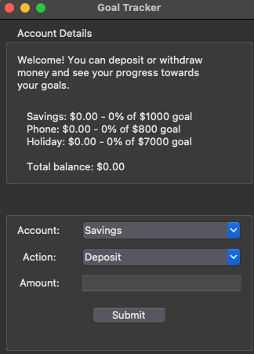

# savings-goal-tracker

## OVERVIEW
The savings goal tracker is a Python-based GUI application using Tkinter.
It allows users to create + manage various savings accounts, deposit + withdraw money, while tracking progress towards their financial goals. 

## ATTACHED BELOW IS A SCREENSHOT OF WHAT THE APPLICATION SHOULD LOOK LIKE :)

